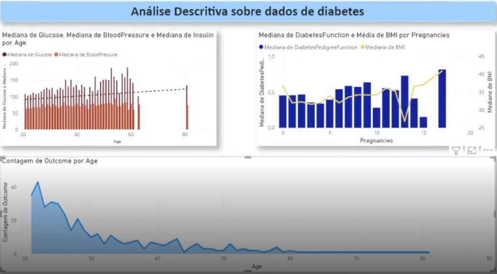

📊 **Gráfico: Indicadores Clínicos por Faixa Etária**  
Indicadores Clínicos por Faixa Etária

Este gráfico apresenta a mediana de três variáveis clínicas — glicose (Glucose), pressão arterial (BloodPressure) e insulina (Insulin) — agrupadas por idade (Age). Cada faixa etária é representada por três elementos visuais:

- Barras vermelhas: Mediana de glicose  
- Barras roxas: Mediana de pressão arterial  
- Linha preta tracejada: Mediana de insulina

🔍 **Interpretação**  
- A mediana de glicose tende a aumentar com a idade, com destaque para faixas acima dos 50 anos, sugerindo maior risco glicêmico em idades avançadas.  
- A pressão arterial apresenta variações mais suaves, mas também cresce levemente com a idade, refletindo padrões esperados de envelhecimento.  
- A mediana de insulina mostra flutuações mais acentuadas, com picos em idades específicas (como 40 e 60 anos), o que pode indicar alterações metabólicas ou variações na resposta insulínica ao longo da vida.

🛠️ **Como foi construído**  
Visual: Gráfico de barras agrupadas com linha sobreposta  
Eixo X: Age (Idade dos pacientes)  
Eixo Y: Valores medianos das variáveis clínicas  
Legenda:  
- Glucose (vermelho)  
- BloodPressure (roxo)  
- Insulin (linha preta tracejada)

🎯 **Objetivo da Visualização**  
Comparar os principais indicadores clínicos relacionados ao diabetes ao longo das faixas etárias  
Identificar padrões de risco associados ao envelhecimento  
Apoiar decisões clínicas com base em tendências fisiológicas observadas nos dados
